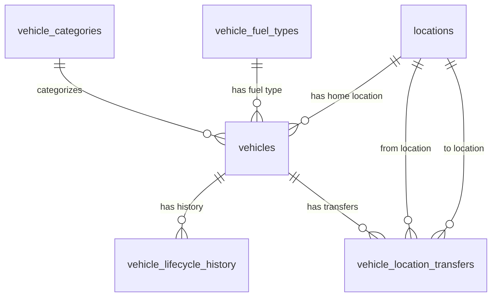

# Database Design - Car Management Lifecycle

## Table of Contents

- [Entity Relationship Diagram](#entity-relationship-diagram)
- [Table Designs](#table-designs)
  - [vehicles](#vehicles)
  - [vehicle_lifecycle_history](#vehicle_lifecycle_history)
  - [locations](#locations)
  - [vehicle_location_transfers](#vehicle_location_transfers)
  - [vehicle_categories](#vehicle_categories)
  - [vehicle_fuel_types](#vehicle_fuel_types)

## Entity Relationship Diagram

## Table Designs

### vehicles

| Field Name | Data Type | Index | Database Constraints | Description |
|------------|-----------|-------|---------------------|-------------|
| id | UUID | PRIMARY KEY | NOT NULL | Unique identifier for the vehicle |
| vin | TEXT | UNIQUE | NOT NULL, UNIQUE | Vehicle Identification Number - must be unique across the system |
| license_plate | TEXT | UNIQUE | NOT NULL, UNIQUE | License plate number - must be unique across the system |
| purchase_date | DATE | | NOT NULL | Date when the vehicle was purchased |
| purchase_cost | DECIMAL(15,2) | | NOT NULL | Purchase cost of the vehicle |
| insurance_policy_number | TEXT | | NOT NULL | Insurance policy number |
| insurance_provider | TEXT | | NOT NULL | Name of the insurance provider |
| insurance_expiration_date | DATE | INDEX | NOT NULL | Insurance expiration date - indexed for quick expiration checks |
| odometer_at_acquisition | INTEGER | | NOT NULL | Odometer reading when vehicle was acquired (in kilometers or miles) |
| current_odometer | INTEGER | | NOT NULL | Current odometer reading |
| brand | TEXT | | NOT NULL | Vehicle brand/manufacturer (e.g., Toyota, Ford) |
| model | TEXT | | NOT NULL | Vehicle model (e.g., Camry, Focus) |
| manufacturing_year | INTEGER | | NOT NULL | Year the vehicle was manufactured |
| category_id | UUID | FOREIGN KEY | NOT NULL, REFERENCES vehicle_categories(id) | Reference to vehicle category (economy/luxury + size) |
| number_of_seats | INTEGER | | NOT NULL, CHECK (number_of_seats IN (4, 7)) | Number of seats - must be either 4 or 7 |
| fuel_type_id | UUID | FOREIGN KEY | NOT NULL, REFERENCES vehicle_fuel_types(id) | Reference to fuel type |
| ownership_type | TEXT | | NOT NULL, DEFAULT 'company_owned' | Ownership type - must be 'company_owned' |
| home_location_id | UUID | FOREIGN KEY, INDEX | NOT NULL, REFERENCES locations(id) | Current home location of the vehicle |
| lifecycle_status | TEXT | INDEX | NOT NULL, DEFAULT 'incoming' | Current lifecycle status: incoming, active, maintenance, decommissioning, sold |
| lifecycle_status_updated_at | TIMESTAMP WITH TIME ZONE | | NOT NULL | Timestamp when lifecycle status was last updated |
| created_at | TIMESTAMP WITH TIME ZONE | | NOT NULL | Timestamp when record was created |
| updated_at | TIMESTAMP WITH TIME ZONE | | NOT NULL | Timestamp when record was last updated |
| deleted_at | TIMESTAMP WITH TIME ZONE | INDEX | | Timestamp when record was soft deleted |
| created_by | TEXT | | NOT NULL | User who created the record |
| updated_by | TEXT | | NOT NULL | User who last updated the record |
| deleted | BOOLEAN | INDEX | NOT NULL, DEFAULT false | Soft delete flag |

### vehicle_lifecycle_history

| Field Name | Data Type | Index | Database Constraints | Description |
|------------|-----------|-------|---------------------|-------------|
| id | UUID | PRIMARY KEY | NOT NULL | Unique identifier for the history record |
| vehicle_id | UUID | FOREIGN KEY, INDEX | NOT NULL, REFERENCES vehicles(id) | Reference to the vehicle |
| previous_status | TEXT | | | Previous lifecycle status (NULL for initial status) |
| new_status | TEXT | | NOT NULL | New lifecycle status: incoming, active, maintenance, decommissioning, sold |
| status_changed_at | TIMESTAMP WITH TIME ZONE | INDEX | NOT NULL | Timestamp when the status changed |
| changed_by | TEXT | | NOT NULL | User who changed the status |
| notes | TEXT | | | Optional notes about the status change |
| created_at | TIMESTAMP WITH TIME ZONE | | NOT NULL | Timestamp when record was created |
| updated_at | TIMESTAMP WITH TIME ZONE | | NOT NULL | Timestamp when record was last updated |
| deleted_at | TIMESTAMP WITH TIME ZONE | INDEX | | Timestamp when record was soft deleted |
| created_by | TEXT | | NOT NULL | User who created the record |
| updated_by | TEXT | | NOT NULL | User who last updated the record |
| deleted | BOOLEAN | INDEX | NOT NULL, DEFAULT false | Soft delete flag |

### locations

| Field Name | Data Type | Index | Database Constraints | Description |
|------------|-----------|-------|---------------------|-------------|
| id | UUID | PRIMARY KEY | NOT NULL | Unique identifier for the location |
| name | TEXT | UNIQUE | NOT NULL, UNIQUE | Name of the location (e.g., "Downtown Seattle", "LAX Airport") |
| address_line1 | TEXT | | NOT NULL | First line of address |
| address_line2 | TEXT | | | Second line of address (optional) |
| city | TEXT | | NOT NULL | City name |
| state_province | TEXT | | NOT NULL | State or province |
| postal_code | TEXT | | NOT NULL | Postal/ZIP code |
| country | TEXT | | NOT NULL | Country name |
| latitude | DECIMAL(10,8) | | | Geographic latitude for mapping |
| longitude | DECIMAL(11,8) | | | Geographic longitude for mapping |
| is_active | BOOLEAN | INDEX | NOT NULL, DEFAULT true | Whether this location is currently active |
| created_at | TIMESTAMP WITH TIME ZONE | | NOT NULL | Timestamp when record was created |
| updated_at | TIMESTAMP WITH TIME ZONE | | NOT NULL | Timestamp when record was last updated |
| deleted_at | TIMESTAMP WITH TIME ZONE | INDEX | | Timestamp when record was soft deleted |
| created_by | TEXT | | NOT NULL | User who created the record |
| updated_by | TEXT | | NOT NULL | User who last updated the record |
| deleted | BOOLEAN | INDEX | NOT NULL, DEFAULT false | Soft delete flag |

### vehicle_location_transfers

| Field Name | Data Type | Index | Database Constraints | Description |
|------------|-----------|-------|---------------------|-------------|
| id | UUID | PRIMARY KEY | NOT NULL | Unique identifier for the transfer record |
| vehicle_id | UUID | FOREIGN KEY, INDEX | NOT NULL, REFERENCES vehicles(id) | Reference to the vehicle being transferred |
| from_location_id | UUID | FOREIGN KEY | NOT NULL, REFERENCES locations(id) | Location the vehicle is being transferred from |
| to_location_id | UUID | FOREIGN KEY | NOT NULL, REFERENCES locations(id) | Location the vehicle is being transferred to |
| transfer_date | TIMESTAMP WITH TIME ZONE | INDEX | NOT NULL | Date and time when the transfer occurred |
| transfer_cost | DECIMAL(15,2) | | NOT NULL | Cost of the transfer charged to company pool |
| transfer_reason | TEXT | | | Optional reason for the transfer |
| transfer_notes | TEXT | | | Optional additional notes about the transfer |
| created_at | TIMESTAMP WITH TIME ZONE | | NOT NULL | Timestamp when record was created |
| updated_at | TIMESTAMP WITH TIME ZONE | | NOT NULL | Timestamp when record was last updated |
| deleted_at | TIMESTAMP WITH TIME ZONE | INDEX | | Timestamp when record was soft deleted |
| created_by | TEXT | | NOT NULL | User who created the record |
| updated_by | TEXT | | NOT NULL | User who last updated the record |
| deleted | BOOLEAN | INDEX | NOT NULL, DEFAULT false | Soft delete flag |

### vehicle_categories

| Field Name | Data Type | Index | Database Constraints | Description |
|------------|-----------|-------|---------------------|-------------|
| id | UUID | PRIMARY KEY | NOT NULL | Unique identifier for the category |
| class_type | TEXT | | NOT NULL | Class type: 'economy' or 'luxury' |
| size | TEXT | | NOT NULL | Size: 'small' or 'medium' |
| category_name | TEXT | UNIQUE | NOT NULL, UNIQUE | Human-readable category name (e.g., "Economy Small", "Luxury Medium") |
| description | TEXT | | | Optional description of the category |
| created_at | TIMESTAMP WITH TIME ZONE | | NOT NULL | Timestamp when record was created |
| updated_at | TIMESTAMP WITH TIME ZONE | | NOT NULL | Timestamp when record was last updated |
| deleted_at | TIMESTAMP WITH TIME ZONE | INDEX | | Timestamp when record was soft deleted |
| created_by | TEXT | | NOT NULL | User who created the record |
| updated_by | TEXT | | NOT NULL | User who last updated the record |
| deleted | BOOLEAN | INDEX | NOT NULL, DEFAULT false | Soft delete flag |

### vehicle_fuel_types

| Field Name | Data Type | Index | Database Constraints | Description |
|------------|-----------|-------|---------------------|-------------|
| id | UUID | PRIMARY KEY | NOT NULL | Unique identifier for the fuel type |
| fuel_type_name | TEXT | UNIQUE | NOT NULL, UNIQUE | Fuel type name: 'gas', 'electric', or 'hybrid' |
| description | TEXT | | | Optional description of the fuel type |
| created_at | TIMESTAMP WITH TIME ZONE | | NOT NULL | Timestamp when record was created |
| updated_at | TIMESTAMP WITH TIME ZONE | | NOT NULL | Timestamp when record was last updated |
| deleted_at | TIMESTAMP WITH TIME ZONE | INDEX | | Timestamp when record was soft deleted |
| created_by | TEXT | | NOT NULL | User who created the record |
| updated_by | TEXT | | NOT NULL | User who last updated the record |
| deleted | BOOLEAN | INDEX | NOT NULL, DEFAULT false | Soft delete flag |
