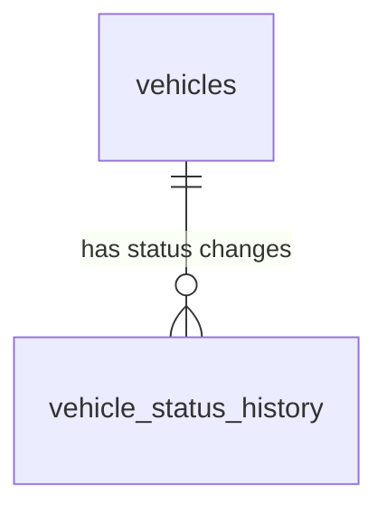

# Database Design - Vehicle Lifecycle Management

## Table of Contents

- [Table of Contents](#table-of-contents)
- [Entity Relationship Diagram](#entity-relationship-diagram)
- [Table Designs](#table-designs)
  - [vehicles](#vehicles)
  - [vehicle_status_history](#vehicle_status_history)

## Entity Relationship Diagram

## Table Designs

### vehicles

This table stores vehicle information with lifecycle status tracking. Note: This design shows only the fields relevant to lifecycle management. The complete vehicle table may contain additional fields for other features.

| Field Name | Data Type | Index | Database Constraints | Description |
|------------|-----------|-------|---------------------|-------------|
| id | UUID | PRIMARY KEY | NOT NULL, UNIQUE | Unique identifier for the vehicle |
| lifecycle_status | TEXT | INDEX | NOT NULL, CHECK (lifecycle_status IN ('incoming', 'active', 'maintenance', 'decommissioning', 'sold')), DEFAULT 'incoming' | Current lifecycle status of the vehicle |
| status_updated_at | TIMESTAMP WITH TIME ZONE | INDEX | NOT NULL, DEFAULT CURRENT_TIMESTAMP | Timestamp when the lifecycle status was last updated |
| status_updated_by | TEXT | | NOT NULL | User ID of the person who last updated the status |
| created_at | TIMESTAMP WITH TIME ZONE | INDEX | NOT NULL, DEFAULT CURRENT_TIMESTAMP | Timestamp when the record was created |
| updated_at | TIMESTAMP WITH TIME ZONE | INDEX | NOT NULL, DEFAULT CURRENT_TIMESTAMP | Timestamp when the record was last updated |
| deleted_at | TIMESTAMP WITH TIME ZONE | INDEX | | Timestamp when the record was soft deleted |
| created_by | TEXT | | NOT NULL | User ID of the person who created the record |
| updated_by | TEXT | | NOT NULL | User ID of the person who last updated the record |
| deleted | BOOLEAN | INDEX | NOT NULL, DEFAULT false | Soft delete flag |

**Indexes:**
- Primary key on `id`
- Index on `lifecycle_status` for filtering vehicles by status
- Index on `status_updated_at` for sorting and date-based queries
- Index on `created_at`, `updated_at`, `deleted_at` for audit trail queries
- Index on `deleted` for efficient soft delete filtering
- Composite index on `(lifecycle_status, deleted)` for frequent availability queries

**Notes:**
- The `lifecycle_status` field uses a CHECK constraint to ensure only valid status values are stored
- Default value for `lifecycle_status` is 'incoming' for newly acquired vehicles
- All status values are stored in lowercase for consistency

### vehicle_status_history

This table maintains a complete audit trail of all vehicle lifecycle status changes.

| Field Name | Data Type | Index | Database Constraints | Description |
|------------|-----------|-------|---------------------|-------------|
| id | UUID | PRIMARY KEY | NOT NULL, UNIQUE | Unique identifier for the status change record |
| vehicle_id | UUID | FOREIGN KEY, INDEX | NOT NULL, REFERENCES vehicles(id) | Foreign key to the vehicles table |
| previous_status | TEXT | INDEX | NOT NULL, CHECK (previous_status IN ('incoming', 'active', 'maintenance', 'decommissioning', 'sold')) | The lifecycle status before the change |
| new_status | TEXT | INDEX | NOT NULL, CHECK (new_status IN ('incoming', 'active', 'maintenance', 'decommissioning', 'sold')) | The lifecycle status after the change |
| changed_at | TIMESTAMP WITH TIME ZONE | INDEX | NOT NULL, DEFAULT CURRENT_TIMESTAMP | Timestamp when the status change occurred |
| changed_by | TEXT | INDEX | NOT NULL | User ID of the person who made the status change |
| notes | TEXT | | | Optional notes or comments about the status change |
| created_at | TIMESTAMP WITH TIME ZONE | INDEX | NOT NULL, DEFAULT CURRENT_TIMESTAMP | Timestamp when the record was created |
| updated_at | TIMESTAMP WITH TIME ZONE | INDEX | NOT NULL, DEFAULT CURRENT_TIMESTAMP | Timestamp when the record was last updated |
| deleted_at | TIMESTAMP WITH TIME ZONE | INDEX | | Timestamp when the record was soft deleted |
| created_by | TEXT | | NOT NULL | User ID of the person who created the record |
| updated_by | TEXT | | NOT NULL | User ID of the person who last updated the record |
| deleted | BOOLEAN | INDEX | NOT NULL, DEFAULT false | Soft delete flag |

**Indexes:**
- Primary key on `id`
- Foreign key index on `vehicle_id` for efficient lookups of status history by vehicle
- Index on `previous_status` and `new_status` for status transition analysis
- Index on `changed_at` for chronological sorting and date-based queries
- Index on `changed_by` for user activity tracking
- Composite index on `(vehicle_id, changed_at DESC, deleted)` for efficient pagination of vehicle history
- Index on `created_at`, `updated_at`, `deleted_at` for audit trail queries
- Index on `deleted` for efficient soft delete filtering

**Foreign Key Constraints:**
- `vehicle_id` REFERENCES `vehicles(id)` ON DELETE RESTRICT
  - Prevents deletion of vehicles that have status history records
  - Ensures referential integrity

**Notes:**
- This table is append-only in normal operations (records are not updated after creation)
- The `updated_at` and `updated_by` fields are included for consistency but typically won't change after initial creation
- Soft delete is supported but should rarely be used, as historical data integrity is important for audit purposes
- The CHECK constraints ensure that only valid status values are recorded in history
- The `changed_at` timestamp is set when the status change occurs and matches the `status_updated_at` in the vehicles table
