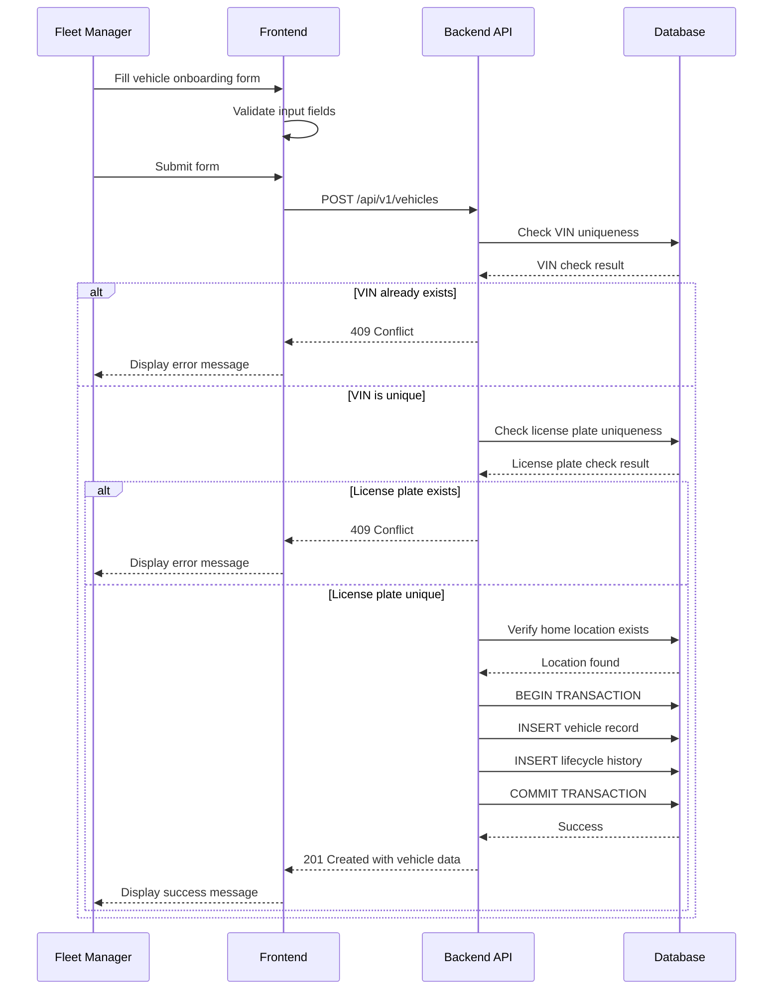
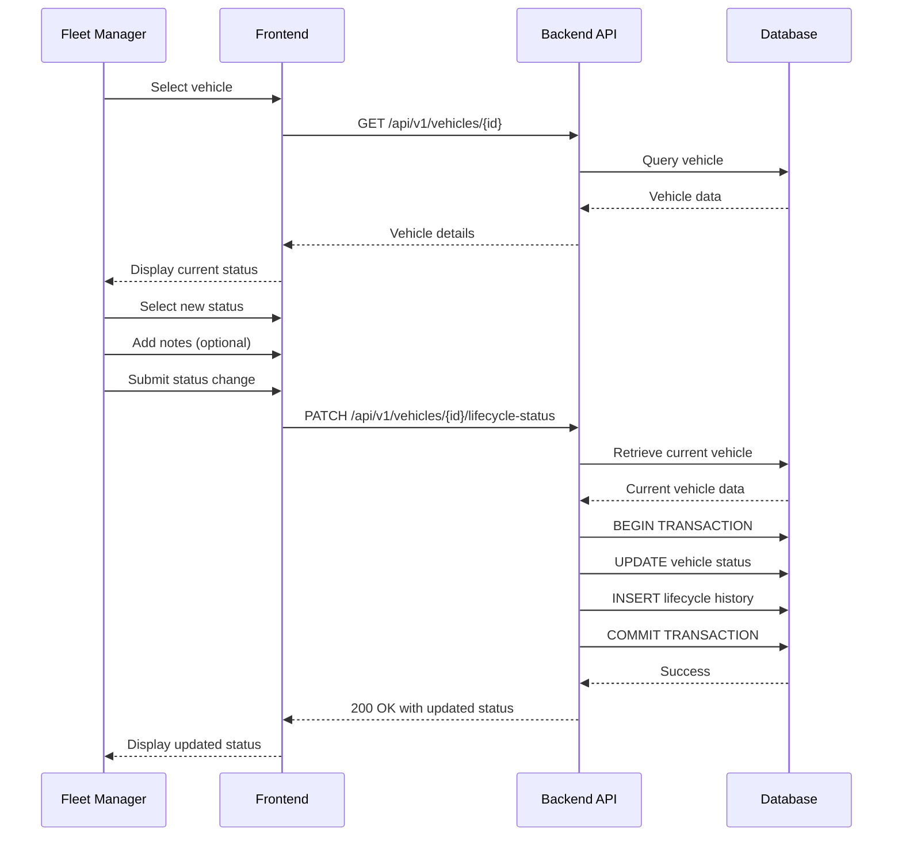
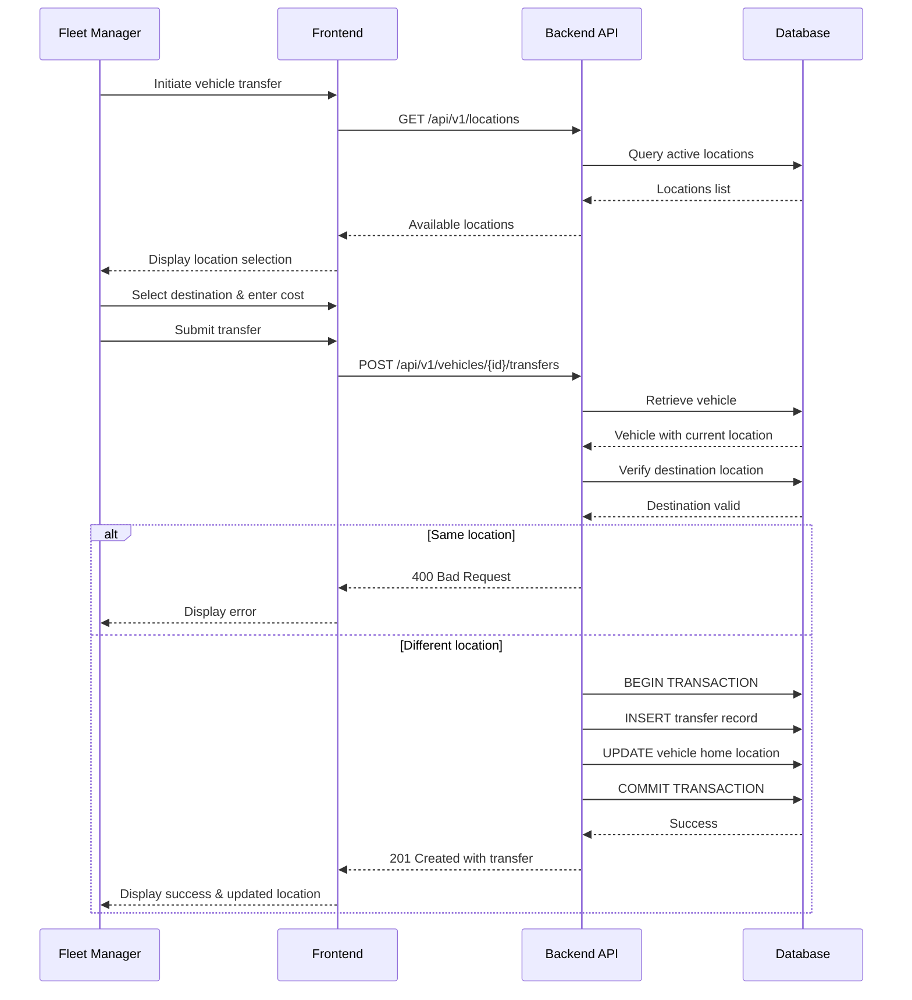

# TRD - Car Management Lifecycle

## Document Information

- **Feature Name:** Car Management Lifecycle (Vehicle Fleet Onboarding and Lifecycle Management)
- **Author:** copilot
- **Date:** 
- **Version:** 

## Table of Contents

- [Document Information](#document-information)
- [Table of Contents](#table-of-contents)
- [Background](#background)
- [In Scope](#in-scope)
- [Constraints](#constraints)
- [Technical Requirements](#technical-requirements)
  - [Database Design](#database-design)
  - [Frontend](#frontend)
  - [Backend](#backend)
- [Security Requirements](#security-requirements)
- [Non-Functional Requirements](#non-functional-requirements)

## Background

This Technical Requirements Document (TRD) implements the functional requirements specified in the Car Management PRD, specifically:
- **FR-1: Vehicle Fleet Onboarding** - [PRD Reference](https://github.com/cristianhoyos66/ai-sdlc-car-rental/blob/main/docs/prd/prd-car-management.md#fr-1-vehicle-fleet-onboarding)
- **FR-2: Vehicle Lifecycle Management** - [PRD Reference](https://github.com/cristianhoyos66/ai-sdlc-car-rental/blob/main/docs/prd/prd-car-management.md#fr-2-vehicle-lifecycle-management)
- **FR-3: Location and Inventory Management** - [PRD Reference](https://github.com/cristianhoyos66/ai-sdlc-car-rental/blob/main/docs/prd/prd-car-management.md#fr-3-location-and-inventory-management)

These requirements enable fleet managers to onboard new vehicles to the rental fleet, manage vehicle lifecycle status transitions, and track vehicle location assignments and transfers across the rental network.

## In Scope

- REST API endpoints for vehicle creation, retrieval, update, and lifecycle management
- REST API endpoints for location management and vehicle transfers
- Database schema for vehicles, lifecycle history, locations, and transfers
- Vehicle data validation including VIN and license plate uniqueness
- Lifecycle status management (incoming, active, maintenance, decommissioning, sold)
- Home location assignment and transfer tracking with cost recording
- Historical tracking of lifecycle status changes and location transfers
- Vehicle categorization (economy/luxury, small/medium) and classification (seats, fuel type)
- Insurance information tracking with expiration dates

## Constraints

- Does not include vehicle availability calculation logic (covered in separate TRD for FR-4)
- Does not include maintenance scheduling (covered in separate TRD for FR-8)
- Does not include GPS telemetry or geofencing (covered in separate TRD for FR-5)
- Does not include pickup, delivery, or return workflows (covered in separate TRDs for FR-6 and FR-7)
- Does not include damage and incident handling (covered in separate TRD for FR-9)
- Does not include reservation system integration (covered in separate TRD)
- Does not implement authentication/authorization mechanisms (assumed to be handled by a separate authentication service)
- Does not include real-time notifications for lifecycle status changes
- Does not include automated workflows or approval processes for status transitions

## Technical Requirements

### Database Design

The database design for car management lifecycle includes the following tables:

- **vehicles** - Primary vehicle information and current state
- **vehicle_lifecycle_history** - Historical record of all lifecycle status changes
- **locations** - Rental network locations
- **vehicle_location_transfers** - Historical record of vehicle location transfers
- **vehicle_categories** - Reference data for vehicle categories (economy/luxury + small/medium)
- **vehicle_fuel_types** - Reference data for fuel types (gas/electric/hybrid)

For complete table definitions including fields, data types, indexes, and constraints, see:
[Database Design - Car Management Lifecycle](./database-design-car-management-lifecycle.md)

### Frontend

#### Vehicle Onboarding Form

- Must provide a comprehensive form for fleet managers to onboard new vehicles
- Form must include all required fields as specified in FR-1:
  - VIN (text input with validation)
  - License plate (text input with validation)
  - Purchase date (date picker)
  - Purchase cost (numeric input with currency formatting)
  - Insurance policy number (text input)
  - Insurance provider (text input)
  - Insurance expiration date (date picker)
  - Odometer reading at acquisition (numeric input)
  - Vehicle brand (text input or dropdown)
  - Vehicle model (text input)
  - Manufacturing year (numeric input or dropdown)
  - Category (dropdown: Economy Small, Economy Medium, Luxury Small, Luxury Medium)
  - Number of seats (dropdown: 4 or 7)
  - Fuel type (dropdown: Gas, Electric, Hybrid)
  - Home location (dropdown populated from locations API)

#### Form Validation

- All required fields must be validated on the client-side before submission
- VIN format validation: alphanumeric, 17 characters (standard VIN format)
- License plate format validation: alphanumeric with optional hyphens/spaces
- Purchase date: cannot be in the future
- Insurance expiration date: must be in the future at time of vehicle creation
- Purchase cost: must be positive decimal number
- Odometer reading: must be non-negative integer
- Manufacturing year: must be between 1900 and current year + 1
- Number of seats: must be exactly 4 or 7
- Inline error messages must be displayed for validation failures
- Form submission button must be disabled until all validations pass

#### Vehicle Management Interface

- Must provide a vehicle list/grid view with filtering and search capabilities
- Must display current lifecycle status with visual indicators (color coding or badges)
- Must provide vehicle detail view showing all vehicle information
- Must allow fleet managers to update lifecycle status through a status dropdown or modal
- Must display lifecycle status history in chronological order
- Must display location transfer history with dates, locations, and costs
- Must provide interface to initiate location transfers with:
  - Source location (current home location, read-only)
  - Destination location (dropdown)
  - Transfer cost (numeric input with currency formatting)
  - Transfer reason (optional text area)
  - Transfer notes (optional text area)

#### Responsive Design

- All interfaces must be responsive and work on desktop browsers (minimum 1024px width)
- Mobile support is not required in this phase (as per constraints)
- Forms must have clear visual hierarchy and appropriate spacing
- Use consistent UI components and styling across all vehicle management screens

### Backend

#### REST API Endpoints

All API endpoints use JSON for request and response bodies. Date/time values must be in ISO 8601 format.

##### Create Vehicle

**Endpoint:** `POST /api/v1/vehicles`

**Request Body:**
```json
{
  "vin": "string",
  "licensePlate": "string",
  "purchaseDate": "YYYY-MM-DD",
  "purchaseCost": "decimal",
  "insurance": {
    "policyNumber": "string",
    "provider": "string",
    "expirationDate": "YYYY-MM-DD"
  },
  "odometerAtAcquisition": "integer",
  "vehicleType": {
    "brand": "string",
    "model": "string",
    "manufacturingYear": "integer"
  },
  "classification": {
    "category": "string",
    "numberOfSeats": "integer",
    "fuelType": "string"
  },
  "homeLocationId": "uuid"
}
```

**Validation Rules:**
- `vin`: Required, must be alphanumeric, exactly 17 characters, must be unique across all vehicles
- `licensePlate`: Required, must be unique across all vehicles
- `purchaseDate`: Required, must be valid date in the past or today
- `purchaseCost`: Required, must be positive decimal
- `insurance.policyNumber`: Required, non-empty string
- `insurance.provider`: Required, non-empty string
- `insurance.expirationDate`: Required, must be a future date
- `odometerAtAcquisition`: Required, must be non-negative integer
- `vehicleType.brand`: Required, non-empty string
- `vehicleType.model`: Required, non-empty string
- `vehicleType.manufacturingYear`: Required, integer between 1900 and current year + 1
- `classification.category`: Required, must be one of: "economy_small", "economy_medium", "luxury_small", "luxury_medium"
- `classification.numberOfSeats`: Required, must be 4 or 7
- `classification.fuelType`: Required, must be one of: "gas", "electric", "hybrid"
- `homeLocationId`: Required, must be a valid UUID referencing an existing active location

**Response (201 Created):**
```json
{
  "id": "uuid",
  "vin": "string",
  "licensePlate": "string",
  "purchaseDate": "YYYY-MM-DD",
  "purchaseCost": "decimal",
  "insurance": {
    "policyNumber": "string",
    "provider": "string",
    "expirationDate": "YYYY-MM-DD"
  },
  "odometerAtAcquisition": "integer",
  "currentOdometer": "integer",
  "vehicleType": {
    "brand": "string",
    "model": "string",
    "manufacturingYear": "integer"
  },
  "classification": {
    "category": "string",
    "numberOfSeats": "integer",
    "fuelType": "string"
  },
  "ownershipType": "company_owned",
  "homeLocation": {
    "id": "uuid",
    "name": "string"
  },
  "lifecycleStatus": "incoming",
  "lifecycleStatusUpdatedAt": "timestamp",
  "createdAt": "timestamp",
  "updatedAt": "timestamp"
}
```

**Error Responses:**
- `400 Bad Request`: Validation errors (e.g., invalid format, missing required fields)
  ```json
  {
    "error": "ValidationError",
    "message": "Validation failed",
    "details": [
      {
        "field": "vin",
        "message": "VIN must be exactly 17 characters"
      }
    ]
  }
  ```
- `409 Conflict`: Duplicate VIN or license plate
  ```json
  {
    "error": "ConflictError",
    "message": "Vehicle with this VIN already exists"
  }
  ```
- `404 Not Found`: Invalid home location ID
  ```json
  {
    "error": "NotFoundError",
    "message": "Location not found"
  }
  ```

**Algorithm:**
```
FUNCTION createVehicle(vehicleData, userId):
  // 1. Validate input data
  VALIDATE vehicleData against schema
  IF validation fails:
    RETURN 400 Bad Request with validation errors
  
  // 2. Check for duplicate VIN
  existingVehicleByVin = QUERY database WHERE vin = vehicleData.vin AND deleted = false
  IF existingVehicleByVin EXISTS:
    RETURN 409 Conflict "Vehicle with this VIN already exists"
  
  // 3. Check for duplicate license plate
  existingVehicleByPlate = QUERY database WHERE license_plate = vehicleData.licensePlate AND deleted = false
  IF existingVehicleByPlate EXISTS:
    RETURN 409 Conflict "Vehicle with this license plate already exists"
  
  // 4. Verify home location exists and is active
  location = QUERY locations WHERE id = vehicleData.homeLocationId AND deleted = false AND is_active = true
  IF location NOT EXISTS:
    RETURN 404 Not Found "Location not found or inactive"
  
  // 5. Lookup category and fuel type IDs
  category = QUERY vehicle_categories WHERE class_type + size matches vehicleData.classification.category
  fuelType = QUERY vehicle_fuel_types WHERE fuel_type_name = vehicleData.classification.fuelType
  
  // 6. Create vehicle record
  BEGIN TRANSACTION
  vehicle = INSERT INTO vehicles:
    id = GENERATE_UUID()
    vin = vehicleData.vin
    license_plate = vehicleData.licensePlate
    purchase_date = vehicleData.purchaseDate
    purchase_cost = vehicleData.purchaseCost
    insurance_policy_number = vehicleData.insurance.policyNumber
    insurance_provider = vehicleData.insurance.provider
    insurance_expiration_date = vehicleData.insurance.expirationDate
    odometer_at_acquisition = vehicleData.odometerAtAcquisition
    current_odometer = vehicleData.odometerAtAcquisition
    brand = vehicleData.vehicleType.brand
    model = vehicleData.vehicleType.model
    manufacturing_year = vehicleData.vehicleType.manufacturingYear
    category_id = category.id
    number_of_seats = vehicleData.classification.numberOfSeats
    fuel_type_id = fuelType.id
    ownership_type = 'company_owned'
    home_location_id = vehicleData.homeLocationId
    lifecycle_status = 'incoming'
    lifecycle_status_updated_at = CURRENT_TIMESTAMP
    created_by = userId
    updated_by = userId
    created_at = CURRENT_TIMESTAMP
    updated_at = CURRENT_TIMESTAMP
    deleted = false
  
  // 7. Create initial lifecycle history record
  INSERT INTO vehicle_lifecycle_history:
    id = GENERATE_UUID()
    vehicle_id = vehicle.id
    previous_status = NULL
    new_status = 'incoming'
    status_changed_at = CURRENT_TIMESTAMP
    changed_by = userId
    created_by = userId
    updated_by = userId
    created_at = CURRENT_TIMESTAMP
    updated_at = CURRENT_TIMESTAMP
    deleted = false
  
  COMMIT TRANSACTION
  
  // 8. Return created vehicle with location details
  RETURN 201 Created with vehicle data including location name
END FUNCTION
```

##### Get Vehicle by ID

**Endpoint:** `GET /api/v1/vehicles/{vehicleId}`

**Path Parameters:**
- `vehicleId`: UUID of the vehicle

**Response (200 OK):**
```json
{
  "id": "uuid",
  "vin": "string",
  "licensePlate": "string",
  "purchaseDate": "YYYY-MM-DD",
  "purchaseCost": "decimal",
  "insurance": {
    "policyNumber": "string",
    "provider": "string",
    "expirationDate": "YYYY-MM-DD"
  },
  "odometerAtAcquisition": "integer",
  "currentOdometer": "integer",
  "vehicleType": {
    "brand": "string",
    "model": "string",
    "manufacturingYear": "integer"
  },
  "classification": {
    "category": "string",
    "numberOfSeats": "integer",
    "fuelType": "string"
  },
  "ownershipType": "company_owned",
  "homeLocation": {
    "id": "uuid",
    "name": "string",
    "address": "string",
    "city": "string",
    "state": "string"
  },
  "lifecycleStatus": "string",
  "lifecycleStatusUpdatedAt": "timestamp",
  "createdAt": "timestamp",
  "updatedAt": "timestamp"
}
```

**Error Responses:**
- `404 Not Found`: Vehicle not found

##### List Vehicles

**Endpoint:** `GET /api/v1/vehicles`

**Query Parameters:**
- `page`: integer (default: 1, min: 1)
- `pageSize`: integer (default: 20, min: 1, max: 100)
- `lifecycleStatus`: string (optional filter: "incoming", "active", "maintenance", "decommissioning", "sold")
- `homeLocationId`: UUID (optional filter)
- `category`: string (optional filter: "economy_small", "economy_medium", "luxury_small", "luxury_medium")
- `fuelType`: string (optional filter: "gas", "electric", "hybrid")
- `search`: string (optional search in VIN, license plate, brand, model)

**Response (200 OK):**
```json
{
  "vehicles": [
    {
      "id": "uuid",
      "vin": "string",
      "licensePlate": "string",
      "vehicleType": {
        "brand": "string",
        "model": "string",
        "manufacturingYear": "integer"
      },
      "classification": {
        "category": "string",
        "numberOfSeats": "integer",
        "fuelType": "string"
      },
      "homeLocation": {
        "id": "uuid",
        "name": "string"
      },
      "lifecycleStatus": "string",
      "currentOdometer": "integer"
    }
  ],
  "pagination": {
    "currentPage": "integer",
    "pageSize": "integer",
    "totalItems": "integer",
    "totalPages": "integer"
  }
}
```

##### Update Vehicle Lifecycle Status

**Endpoint:** `PATCH /api/v1/vehicles/{vehicleId}/lifecycle-status`

**Path Parameters:**
- `vehicleId`: UUID of the vehicle

**Request Body:**
```json
{
  "newStatus": "string",
  "notes": "string"
}
```

**Validation Rules:**
- `newStatus`: Required, must be one of: "incoming", "active", "maintenance", "decommissioning", "sold"
- `notes`: Optional, string up to 1000 characters

**Response (200 OK):**
```json
{
  "id": "uuid",
  "lifecycleStatus": "string",
  "lifecycleStatusUpdatedAt": "timestamp",
  "updatedAt": "timestamp"
}
```

**Error Responses:**
- `400 Bad Request`: Invalid status value
- `404 Not Found`: Vehicle not found

**Algorithm:**
```
FUNCTION updateLifecycleStatus(vehicleId, newStatus, notes, userId):
  // 1. Validate new status
  validStatuses = ["incoming", "active", "maintenance", "decommissioning", "sold"]
  IF newStatus NOT IN validStatuses:
    RETURN 400 Bad Request "Invalid lifecycle status"
  
  // 2. Retrieve current vehicle
  vehicle = QUERY vehicles WHERE id = vehicleId AND deleted = false
  IF vehicle NOT EXISTS:
    RETURN 404 Not Found "Vehicle not found"
  
  // 3. Check if status is changing
  IF vehicle.lifecycle_status = newStatus:
    RETURN 200 OK with current vehicle data (no change needed)
  
  // 4. Update vehicle and create history record
  BEGIN TRANSACTION
  
  previousStatus = vehicle.lifecycle_status
  currentTime = CURRENT_TIMESTAMP
  
  UPDATE vehicles SET:
    lifecycle_status = newStatus
    lifecycle_status_updated_at = currentTime
    updated_at = currentTime
    updated_by = userId
  WHERE id = vehicleId
  
  INSERT INTO vehicle_lifecycle_history:
    id = GENERATE_UUID()
    vehicle_id = vehicleId
    previous_status = previousStatus
    new_status = newStatus
    status_changed_at = currentTime
    changed_by = userId
    notes = notes
    created_by = userId
    updated_by = userId
    created_at = currentTime
    updated_at = currentTime
    deleted = false
  
  COMMIT TRANSACTION
  
  // 5. Return updated vehicle status
  RETURN 200 OK with updated vehicle data
END FUNCTION
```

##### Get Vehicle Lifecycle History

**Endpoint:** `GET /api/v1/vehicles/{vehicleId}/lifecycle-history`

**Path Parameters:**
- `vehicleId`: UUID of the vehicle

**Response (200 OK):**
```json
{
  "vehicleId": "uuid",
  "history": [
    {
      "id": "uuid",
      "previousStatus": "string",
      "newStatus": "string",
      "statusChangedAt": "timestamp",
      "changedBy": "string",
      "notes": "string"
    }
  ]
}
```

**Error Responses:**
- `404 Not Found`: Vehicle not found

##### Create Location Transfer

**Endpoint:** `POST /api/v1/vehicles/{vehicleId}/transfers`

**Path Parameters:**
- `vehicleId`: UUID of the vehicle

**Request Body:**
```json
{
  "toLocationId": "uuid",
  "transferCost": "decimal",
  "transferReason": "string",
  "transferNotes": "string"
}
```

**Validation Rules:**
- `toLocationId`: Required, must be valid UUID of an active location
- `transferCost`: Required, must be non-negative decimal
- `transferReason`: Optional, string up to 500 characters
- `transferNotes`: Optional, string up to 1000 characters
- `toLocationId` must be different from vehicle's current home location

**Response (201 Created):**
```json
{
  "id": "uuid",
  "vehicleId": "uuid",
  "fromLocation": {
    "id": "uuid",
    "name": "string"
  },
  "toLocation": {
    "id": "uuid",
    "name": "string"
  },
  "transferDate": "timestamp",
  "transferCost": "decimal",
  "transferReason": "string",
  "transferNotes": "string",
  "createdAt": "timestamp"
}
```

**Error Responses:**
- `400 Bad Request`: Validation errors or same location transfer
- `404 Not Found`: Vehicle or location not found

**Algorithm:**
```
FUNCTION createLocationTransfer(vehicleId, transferData, userId):
  // 1. Validate input
  VALIDATE transferData against schema
  IF validation fails:
    RETURN 400 Bad Request with validation errors
  
  // 2. Retrieve vehicle
  vehicle = QUERY vehicles WHERE id = vehicleId AND deleted = false
  IF vehicle NOT EXISTS:
    RETURN 404 Not Found "Vehicle not found"
  
  // 3. Verify destination location exists and is active
  toLocation = QUERY locations WHERE id = transferData.toLocationId AND deleted = false AND is_active = true
  IF toLocation NOT EXISTS:
    RETURN 404 Not Found "Destination location not found or inactive"
  
  // 4. Check not transferring to same location
  IF vehicle.home_location_id = transferData.toLocationId:
    RETURN 400 Bad Request "Vehicle is already at this location"
  
  // 5. Get from location details
  fromLocation = QUERY locations WHERE id = vehicle.home_location_id
  
  // 6. Create transfer record and update vehicle
  BEGIN TRANSACTION
  
  currentTime = CURRENT_TIMESTAMP
  
  transfer = INSERT INTO vehicle_location_transfers:
    id = GENERATE_UUID()
    vehicle_id = vehicleId
    from_location_id = vehicle.home_location_id
    to_location_id = transferData.toLocationId
    transfer_date = currentTime
    transfer_cost = transferData.transferCost
    transfer_reason = transferData.transferReason
    transfer_notes = transferData.transferNotes
    created_by = userId
    updated_by = userId
    created_at = currentTime
    updated_at = currentTime
    deleted = false
  
  UPDATE vehicles SET:
    home_location_id = transferData.toLocationId
    updated_at = currentTime
    updated_by = userId
  WHERE id = vehicleId
  
  COMMIT TRANSACTION
  
  // 7. Return transfer details with location names
  RETURN 201 Created with transfer data
END FUNCTION
```

##### Get Vehicle Transfer History

**Endpoint:** `GET /api/v1/vehicles/{vehicleId}/transfers`

**Path Parameters:**
- `vehicleId`: UUID of the vehicle

**Query Parameters:**
- `page`: integer (default: 1, min: 1)
- `pageSize`: integer (default: 20, min: 1, max: 100)

**Response (200 OK):**
```json
{
  "vehicleId": "uuid",
  "transfers": [
    {
      "id": "uuid",
      "fromLocation": {
        "id": "uuid",
        "name": "string"
      },
      "toLocation": {
        "id": "uuid",
        "name": "string"
      },
      "transferDate": "timestamp",
      "transferCost": "decimal",
      "transferReason": "string",
      "transferNotes": "string"
    }
  ],
  "pagination": {
    "currentPage": "integer",
    "pageSize": "integer",
    "totalItems": "integer",
    "totalPages": "integer"
  }
}
```

**Error Responses:**
- `404 Not Found`: Vehicle not found

##### Create Location

**Endpoint:** `POST /api/v1/locations`

**Request Body:**
```json
{
  "name": "string",
  "address": {
    "line1": "string",
    "line2": "string",
    "city": "string",
    "stateProvince": "string",
    "postalCode": "string",
    "country": "string"
  },
  "coordinates": {
    "latitude": "decimal",
    "longitude": "decimal"
  }
}
```

**Validation Rules:**
- `name`: Required, must be unique, non-empty string
- `address.line1`: Required, non-empty string
- `address.line2`: Optional
- `address.city`: Required, non-empty string
- `address.stateProvince`: Required, non-empty string
- `address.postalCode`: Required, non-empty string
- `address.country`: Required, non-empty string
- `coordinates.latitude`: Optional, decimal between -90 and 90
- `coordinates.longitude`: Optional, decimal between -180 and 180

**Response (201 Created):**
```json
{
  "id": "uuid",
  "name": "string",
  "address": {
    "line1": "string",
    "line2": "string",
    "city": "string",
    "stateProvince": "string",
    "postalCode": "string",
    "country": "string"
  },
  "coordinates": {
    "latitude": "decimal",
    "longitude": "decimal"
  },
  "isActive": true,
  "createdAt": "timestamp",
  "updatedAt": "timestamp"
}
```

**Error Responses:**
- `400 Bad Request`: Validation errors
- `409 Conflict`: Location name already exists

##### List Locations

**Endpoint:** `GET /api/v1/locations`

**Query Parameters:**
- `page`: integer (default: 1, min: 1)
- `pageSize`: integer (default: 20, min: 1, max: 100)
- `isActive`: boolean (optional filter, default: true)

**Response (200 OK):**
```json
{
  "locations": [
    {
      "id": "uuid",
      "name": "string",
      "city": "string",
      "stateProvince": "string",
      "country": "string",
      "isActive": "boolean"
    }
  ],
  "pagination": {
    "currentPage": "integer",
    "pageSize": "integer",
    "totalItems": "integer",
    "totalPages": "integer"
  }
}
```

#### Sequence Diagrams

##### Vehicle Onboarding Flow



##### Lifecycle Status Update Flow



##### Location Transfer Flow



## Security Requirements

### Authentication and Authorization

- All API endpoints require authentication using JWT (JSON Web Token)
- JWT must use the HS256 or RS256 algorithm
- JWT payload must contain:
  ```json
  {
    "sub": "user_id",
    "email": "user@example.com",
    "roles": ["fleet_manager", "operations_staff"],
    "iat": "issued_at_timestamp",
    "exp": "expiration_timestamp"
  }
  ```
- JWT expiration should be set to 8 hours for regular sessions
- Refresh tokens should be used for extended sessions

### Role-Based Access Control

- **Fleet Manager Role**: Full access to all vehicle management operations
  - Create vehicles
  - Update vehicle lifecycle status
  - Initiate location transfers
  - View all vehicle data and history
  - Manage locations

- **Operations Staff Role**: Limited access
  - View vehicle information
  - View lifecycle history
  - View transfer history
  - Cannot create vehicles or update lifecycle status

- **Read-Only Role**: View-only access
  - View vehicle information
  - View lifecycle history
  - View transfer history
  - No modification permissions

### API Security

- All API endpoints must use HTTPS/TLS 1.2 or higher
- API must validate JWT signature on every request
- API must check user roles against required permissions for each endpoint
- API must implement rate limiting: 100 requests per minute per user
- API must log all authentication failures and authorization denials
- API must sanitize all user inputs to prevent SQL injection
- API must validate all UUID parameters to ensure proper format
- API must implement CORS (Cross-Origin Resource Sharing) with allowed origins list

### Data Security

- Sensitive data (insurance policy numbers) should not be logged
- Database connections must use encrypted connections (SSL/TLS)
- Database credentials must be stored in secure configuration management (not in code)
- Personal identifiable information (PII) access must be audited
- All database queries must use parameterized queries/prepared statements

### Audit Logging

- All vehicle creation, updates, and transfers must be logged with:
  - Timestamp
  - User ID who performed the action
  - Action type
  - Resource ID (vehicle ID, location ID)
  - IP address of the request
- Logs must be retained for minimum 90 days
- Logs must be stored in a secure, tamper-proof system

## Non-Functional Requirements

*This section is intentionally left blank as per documentation standards.*

---

*This document was generated with the assistance of artificial intelligence and should be reviewed by a human for accuracy and completeness.*
