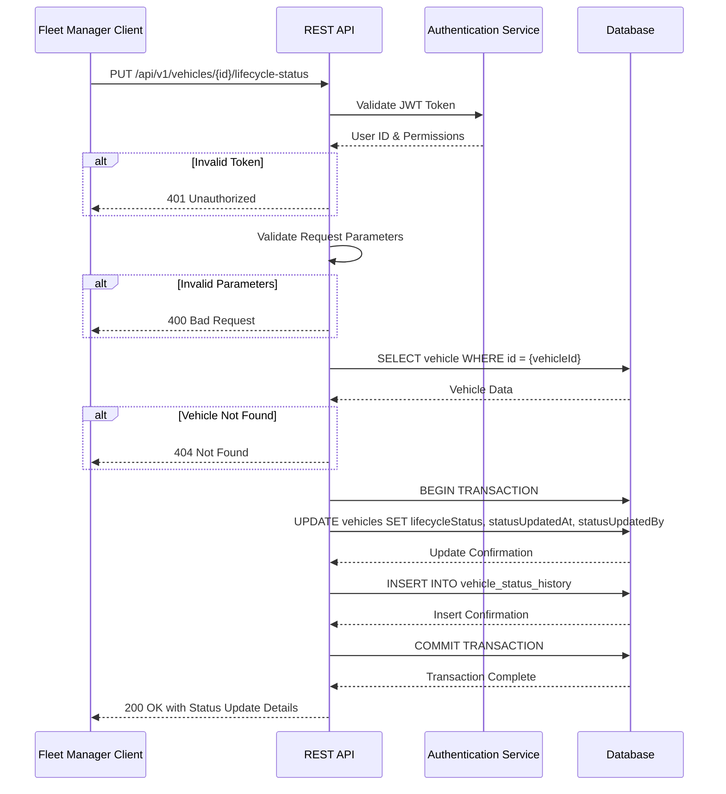
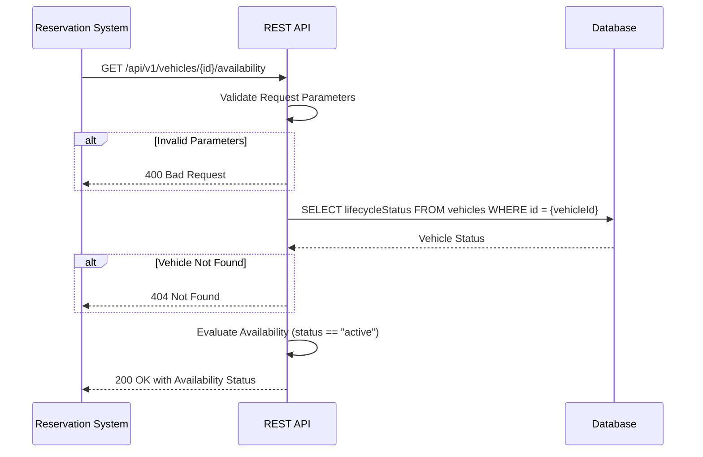

# TRD - Vehicle Lifecycle Management

## Document Information

+ Feature Name: Vehicle Lifecycle Management
+ Author: @copilot
+ Date: 
+ Version: 

## Table of Contents

- [Document Information](#document-information)
- [Table of Contents](#table-of-contents)
- [Background](#background)
- [In Scope](#in-scope)
- [Constraints](#constraints)
- [Technical Requirements](#technical-requirements)
  - [Database Design](#database-design)
  - [Backend](#backend)
- [Security Requirement](#security-requirement)
- [Non-Functional Requirements](#non-functional-requirements)
- [AI Usage Disclaimer](#ai-usage-disclaimer)

## Background

This TRD implements the functional requirement **FR-2: Vehicle Lifecycle Management** defined in the [Car Management PRD](../prd/prd-car-management.md#fr-2-vehicle-lifecycle-management).

The requirement addresses the need for fleet managers to track and update vehicle lifecycle status throughout the vehicle's operational lifetime, from acquisition to disposal. This ensures proper vehicle availability management and operational state tracking.

## In Scope

- Database schema for storing vehicle lifecycle status and status history
- REST API endpoints for retrieving current vehicle lifecycle status
- REST API endpoints for updating vehicle lifecycle status
- Status transition validation and recording with timestamps
- Support for defined lifecycle statuses: Incoming, Active, Maintenance, Decommissioning, Sold
- Integration points for vehicle availability checking

## Constraints

- This TRD does not cover automated status transitions based on business rules or triggers
- This TRD does not define the user interface or frontend components
- This TRD does not cover notifications or alerts related to status changes
- This TRD does not address workflow approval processes for status changes
- This TRD does not cover bulk status update operations
- This TRD does not define reporting or analytics features for lifecycle tracking

## Technical Requirements

### Database Design

The database design includes the following tables:

- **vehicles**: Extended with lifecycle status field (see [database-design-vehicle-lifecycle-management.md](database-design-vehicle-lifecycle-management.md#vehicles))
- **vehicle_status_history**: Records all status changes with timestamps (see [database-design-vehicle-lifecycle-management.md](database-design-vehicle-lifecycle-management.md#vehicle_status_history))

### Backend

#### REST API Endpoints

**1. Get Vehicle Lifecycle Status**

- **HTTP Method**: GET
- **URL**: `/api/v1/vehicles/{vehicleId}/lifecycle-status`
- **Path Parameters**:
  - `vehicleId` (required, UUID): The unique identifier of the vehicle
- **Query Parameters**: None
- **Request Body**: None
- **Response Body** (200 OK):
  ```json
  {
    "vehicleId": "uuid",
    "currentStatus": "string",
    "statusUpdatedAt": "timestamp",
    "statusUpdatedBy": "string"
  }
  ```
- **Response Body** (404 Not Found):
  ```json
  {
    "error": "Vehicle not found",
    "vehicleId": "uuid"
  }
  ```

**2. Update Vehicle Lifecycle Status**

- **HTTP Method**: PUT
- **URL**: `/api/v1/vehicles/{vehicleId}/lifecycle-status`
- **Path Parameters**:
  - `vehicleId` (required, UUID): The unique identifier of the vehicle
- **Query Parameters**: None
- **Request Body**:
  ```json
  {
    "newStatus": "string",
    "notes": "string (optional)"
  }
  ```
- **Response Body** (200 OK):
  ```json
  {
    "vehicleId": "uuid",
    "previousStatus": "string",
    "currentStatus": "string",
    "statusUpdatedAt": "timestamp",
    "statusUpdatedBy": "string"
  }
  ```
- **Response Body** (400 Bad Request):
  ```json
  {
    "error": "Invalid status value",
    "allowedValues": ["incoming", "active", "maintenance", "decommissioning", "sold"]
  }
  ```
- **Response Body** (404 Not Found):
  ```json
  {
    "error": "Vehicle not found",
    "vehicleId": "uuid"
  }
  ```

**3. Get Vehicle Status History**

- **HTTP Method**: GET
- **URL**: `/api/v1/vehicles/{vehicleId}/lifecycle-status/history`
- **Path Parameters**:
  - `vehicleId` (required, UUID): The unique identifier of the vehicle
- **Query Parameters**:
  - `page` (optional, integer, default: 1): Page number for pagination
  - `pageSize` (optional, integer, default: 20, max: 100): Number of records per page
  - `fromDate` (optional, ISO 8601 date): Filter history from this date
  - `toDate` (optional, ISO 8601 date): Filter history to this date
- **Request Body**: None
- **Response Body** (200 OK):
  ```json
  {
    "vehicleId": "uuid",
    "totalRecords": "integer",
    "page": "integer",
    "pageSize": "integer",
    "history": [
      {
        "statusChangeId": "uuid",
        "previousStatus": "string",
        "newStatus": "string",
        "changedAt": "timestamp",
        "changedBy": "string",
        "notes": "string"
      }
    ]
  }
  ```
- **Response Body** (404 Not Found):
  ```json
  {
    "error": "Vehicle not found",
    "vehicleId": "uuid"
  }
  ```

**4. Check Vehicle Availability**

- **HTTP Method**: GET
- **URL**: `/api/v1/vehicles/{vehicleId}/availability`
- **Path Parameters**:
  - `vehicleId` (required, UUID): The unique identifier of the vehicle
- **Query Parameters**: None
- **Request Body**: None
- **Response Body** (200 OK):
  ```json
  {
    "vehicleId": "uuid",
    "isAvailableForRental": "boolean",
    "currentStatus": "string",
    "reason": "string (optional, populated when not available)"
  }
  ```
- **Response Body** (404 Not Found):
  ```json
  {
    "error": "Vehicle not found",
    "vehicleId": "uuid"
  }
  ```

#### API Parameter Validation

**Vehicle ID Validation:**
- Must be a valid UUID format (e.g., `550e8400-e29b-41d4-a716-446655440000`)
- Must exist in the vehicles table

**Status Value Validation:**
- Must be one of the allowed values (case-insensitive): `incoming`, `active`, `maintenance`, `decommissioning`, `sold`
- Stored in lowercase in the database

**Notes Field Validation:**
- Maximum length: No limit (TEXT data type)
- Optional field
- Must be sanitized to prevent XSS attacks

**Date Parameters Validation:**
- Must follow ISO 8601 format (e.g., `2026-02-13T00:10:03.449Z`)
- `fromDate` must be before or equal to `toDate` when both are provided

**Pagination Parameters Validation:**
- `page`: Must be a positive integer (minimum: 1)
- `pageSize`: Must be a positive integer between 1 and 100

#### API Logic and Algorithms

**Algorithm 1: Update Vehicle Lifecycle Status**

```pseudocode
FUNCTION updateVehicleLifecycleStatus(vehicleId, newStatus, notes, userId):
    // Step 1: Validate inputs
    IF NOT isValidUUID(vehicleId) THEN
        RETURN error "Invalid vehicle ID format"
    END IF
    
    IF NOT isValidStatus(newStatus) THEN
        RETURN error "Invalid status value"
    END IF
    
    // Step 2: Retrieve vehicle
    vehicle = getVehicleById(vehicleId)
    IF vehicle IS NULL THEN
        RETURN error "Vehicle not found"
    END IF
    
    // Step 3: Check if status is actually changing
    currentStatus = vehicle.lifecycleStatus
    normalizedNewStatus = toLowerCase(newStatus)
    
    IF currentStatus == normalizedNewStatus THEN
        RETURN success (no change needed)
    END IF
    
    // Step 4: Begin database transaction
    BEGIN TRANSACTION
    
    TRY
        // Step 5: Update vehicle status
        currentTimestamp = getCurrentTimestamp()
        
        UPDATE vehicles
        SET lifecycleStatus = normalizedNewStatus,
            statusUpdatedAt = currentTimestamp,
            statusUpdatedBy = userId,
            updated_at = currentTimestamp,
            updated_by = userId
        WHERE id = vehicleId
        
        // Step 6: Record status change in history
        INSERT INTO vehicle_status_history (
            id,
            vehicle_id,
            previous_status,
            new_status,
            changed_at,
            changed_by,
            notes,
            created_at,
            created_by
        ) VALUES (
            generateUUID(),
            vehicleId,
            currentStatus,
            normalizedNewStatus,
            currentTimestamp,
            userId,
            notes,
            currentTimestamp,
            userId
        )
        
        // Step 7: Commit transaction
        COMMIT TRANSACTION
        
        // Step 8: Return success response
        RETURN success {
            vehicleId: vehicleId,
            previousStatus: currentStatus,
            currentStatus: normalizedNewStatus,
            statusUpdatedAt: currentTimestamp,
            statusUpdatedBy: userId
        }
        
    CATCH error
        ROLLBACK TRANSACTION
        LOG error
        RETURN error "Failed to update vehicle status"
    END TRY
END FUNCTION
```

**Algorithm 2: Check Vehicle Availability**

```pseudocode
FUNCTION checkVehicleAvailability(vehicleId):
    // Step 1: Validate input
    IF NOT isValidUUID(vehicleId) THEN
        RETURN error "Invalid vehicle ID format"
    END IF
    
    // Step 2: Retrieve vehicle
    vehicle = getVehicleById(vehicleId)
    IF vehicle IS NULL THEN
        RETURN error "Vehicle not found"
    END IF
    
    // Step 3: Check lifecycle status
    currentStatus = vehicle.lifecycleStatus
    isAvailable = (currentStatus == "active")
    
    // Step 4: Determine reason if not available
    IF NOT isAvailable THEN
        reason = getUnavailabilityReason(currentStatus)
    ELSE
        reason = NULL
    END IF
    
    // Step 5: Return availability response
    RETURN success {
        vehicleId: vehicleId,
        isAvailableForRental: isAvailable,
        currentStatus: currentStatus,
        reason: reason
    }
END FUNCTION

FUNCTION getUnavailabilityReason(status):
    SWITCH status
        CASE "incoming":
            RETURN "Vehicle is not yet operational"
        CASE "maintenance":
            RETURN "Vehicle is undergoing service or repair"
        CASE "decommissioning":
            RETURN "Vehicle is being prepared for disposal"
        CASE "sold":
            RETURN "Vehicle has been disposed or sold"
        DEFAULT:
            RETURN "Vehicle is not in active status"
    END SWITCH
END FUNCTION
```

**Sequence Diagram: Update Vehicle Lifecycle Status**



**Sequence Diagram: Check Vehicle Availability**



## Security Requirement

### Authentication

All API endpoints must be protected with JWT (JSON Web Token) authentication:

- **Algorithm**: HS256 (HMAC with SHA-256)
- **Token Expiration**: Tokens must have a reasonable expiration time (e.g., 1 hour for access tokens)
- **Token Payload**:
  ```json
  {
    "sub": "user-uuid",
    "username": "string",
    "roles": ["fleet_manager", "admin"],
    "iat": "timestamp",
    "exp": "timestamp"
  }
  ```

### Authorization

Role-based access control (RBAC) must be implemented:

- **View Vehicle Status** (`GET /api/v1/vehicles/{vehicleId}/lifecycle-status`):
  - Requires role: `fleet_manager`, `admin`, or `viewer`
  
- **Update Vehicle Status** (`PUT /api/v1/vehicles/{vehicleId}/lifecycle-status`):
  - Requires role: `fleet_manager` or `admin`
  
- **View Status History** (`GET /api/v1/vehicles/{vehicleId}/lifecycle-status/history`):
  - Requires role: `fleet_manager`, `admin`, or `viewer`
  
- **Check Vehicle Availability** (`GET /api/v1/vehicles/{vehicleId}/availability`):
  - Requires role: Any authenticated user (used by reservation system)

### Data Protection

- **Audit Trail**: All status changes must be recorded in the `vehicle_status_history` table with user identification
- **Input Sanitization**: All text inputs (especially notes field) must be sanitized to prevent SQL injection and XSS attacks
- **HTTPS Only**: All API endpoints must be accessible only via HTTPS in production environments
- **Rate Limiting**: Implement rate limiting to prevent abuse (e.g., 100 requests per minute per user)

### Data Privacy

- **Personal Data**: User IDs recorded in history tables must comply with data protection regulations
- **Soft Delete**: Vehicle records should use soft delete (deleted flag) to maintain historical integrity
- **Access Logs**: API access logs should be maintained for security auditing purposes

## Non-Functional Requirements

## AI Usage Disclaimer

*This document was generated with the assistance of artificial intelligence and should be reviewed by a human for accuracy and completeness.*
